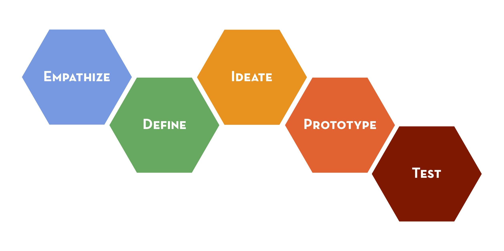
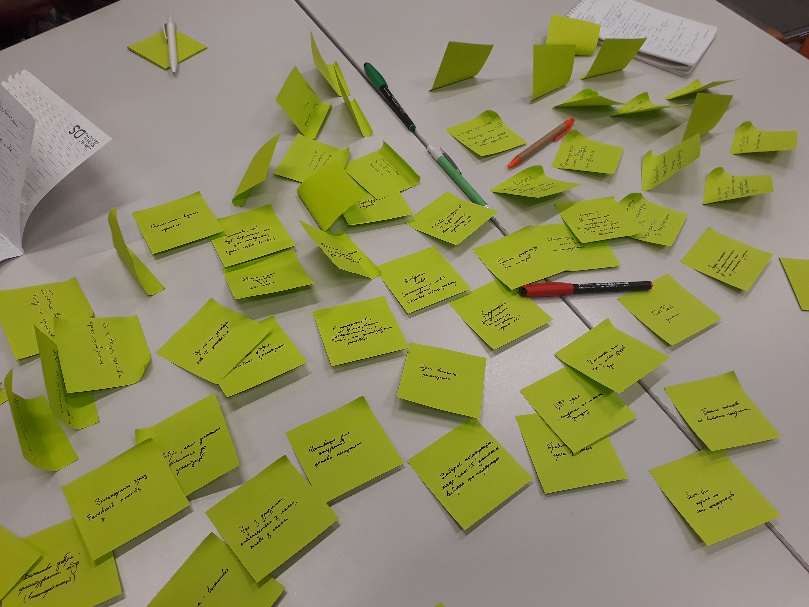
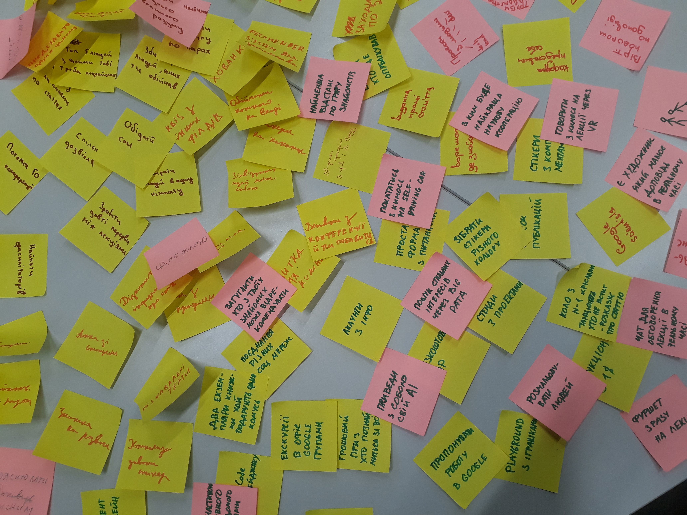
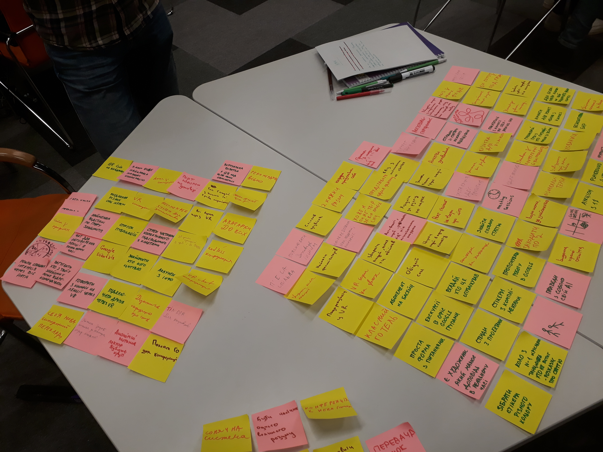
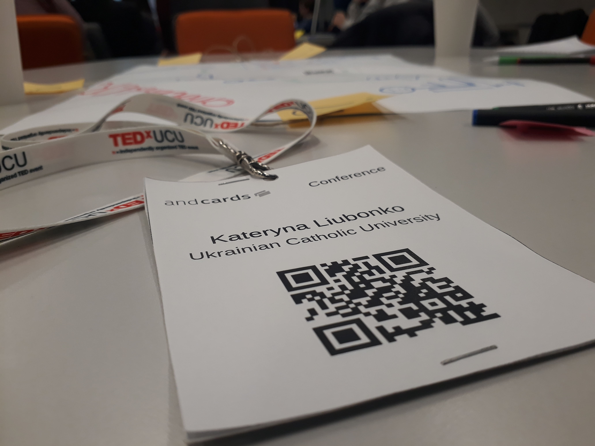
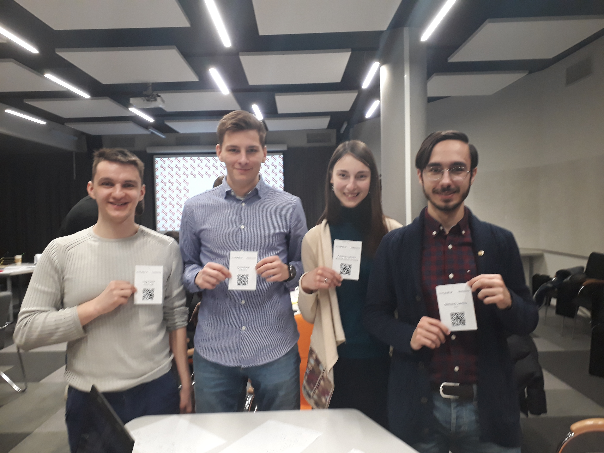
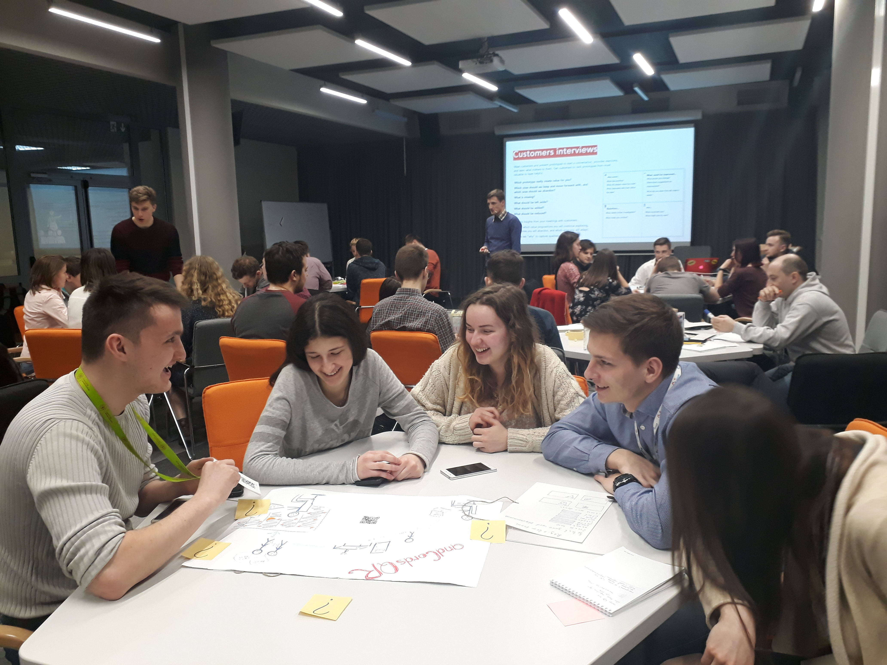
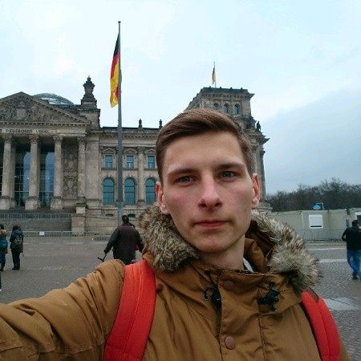

# andCardsQR

We demonstrate the first prototype of our solution to the problem of ineffective networking during large and medium-sized conferences. You can watch the video to see how it works: https://youtu.be/GtwK_A4dS3s.

The prototype was created during the Design Thinking course taught by Oleksandr Akymenko at Data Science Master program of Ukrainian Catholic University. The course was mostly practical. We were divided into 6 groups of 4 people, and learned design thinking while working on an actual business case provided by a partner company.

## Business case

The business case for this course was provided by [andCards](https://andcards.com) - a company based in South Korea that provides software for coworking spaces.

## Design Thinking workflow

> Design thinking is a human-centered approach to innovation that draws from the designer's toolkit to integrate the needs of people, the possibilities of technology, and the requirements for business success.
>
> -- <cite>Tim Brown, CEO of IDEO</cite>

Design thinking process can be divided into five steps

It starts with identifying the needs of people and clearly articulating the problem that will be solved. During these first two steps we don't think about solutions. We only try to understand the real problem. Then we brainstorm ideas - as many as posiible. We prototype those ideas and test them by letting the people we've interviewed use them and give us their feedback. The whole process is iterative. If the feedback is negative we try to understand what has to be improved. If the problem is ill-defined we go back to steps 1 and 2. If the chosen solution doesn't quite solve the problem we brainstorm more ideas.

This way we make sure that we fail quick and through the process of continuous iterations we improve our solution before we start investing money into the complex implementation.

### Step 1: Empatize

In order to understand the deep needs of people who attend conferences, we have interviewed 10 people, including
* 1 professor of history
* 1 professor of mathematics
* 1 senior software developer
* 1 student of Lviv Business School
* 6 Computer Science bachelor students

We were asking them various questions, trying to gain insight about both their good and bad experiences. The information we acquired was very unstructured, but we could already see some patterns in how people with such different backgrounds behave, what drives them, and what causes problems.

Of course, a sample of 10 people from one university is not enough for some generalized statistical inference, but it's enough to give us the idea of what problems people face when attending conferences.

### Step 2: Define

Once we had enough information to process it was time to mine it for useful insights that would allow us to identify problems those people are facing on conferences and clearly define one specific problem we will be trying to solve

### Step 3: Ideate

On this step we started brainstorming the ideas. It's truly impressive how many ideas can four people generate in 20 minutes.  Most ideas were just crazy and required things like teleportation, space travel, or collective superintelligence. But we were going for quantity, not quality, and building on top of these silly ideas we came up with really good ones. 

After having generated over 100 ideas we went on to structure and organize them. We separated them into several clusters, grouped together similar ideas, and classified them by their impact and feasability.

As a result, there was one idea that was both impactful and easy to implement. Since andCards has an app that allows users to thare their business cards, **we decided to add QR codes to attendee conference badges that could be scanned by that app and allow people who have met each other on a conference share digital business cards with a single click of button.**

### Step 4: Prototype

As a first prototype we have created this repository with the drafts of our digital business cards as simple HTML pages with links and information. We printed conference badges with QR codes that link to these cards and created a simple Android app with a single button that reads QR and immediately shows a business card.

**The process of exchanging digital business cards:**

1. In order to buy a ticket to a conference, you must fill a standard registration form (name, email etc.). If you are already a user of andCards, you can simply log in, and all the necessary information will be taken from your account (your digital business card). If you have never used andCards before, a temporary business card will be automatically generated for you from the data you fill into the registration form.
2. On the day of the conference you receive a badge with your name and QR code that links to your business card.
3. As you make new connections you can ask them to share business cards. You take out your phone and scan the code on the badge of your colleague. That's it. Once the codewas scanned on one device, your digital business cards are exchanged and each one of you will have the contacts of the other in his personal wallet.
4. Once the conference has ended, you come home and receive the letter with the list of all the people you have met (you can also find them in your digital wallet) and some recommendations on how to stay in touch.

### Step 5: Test

Now that we had a simple working prototype, it was time to let the potential users test it and gather thir feedback. We invited seven students from different majors and universities, showed them our prototypes, let them wear the badges and scan the barcodes. Once they've had a hands-on experience with our product, we were asking them different questions. What was good? What was bad? Was it easy to exchange the business cards? Did it feel awkward? How would you improve it?

Though everyone liked our solution, there were several concerns that helped us understand the problems we didn't see before. Most important ones were these:

1. Security issues. On a big conference you never know who can scan your QR code in a big crowd. Of course, you will get his business card as well (and may even revoke that exchange later) but he will already see your contacts.
2. Not everyone is technology-friendly. Some people don't have smartphones, don't have andCards app installed, and don't want to use QR readers. They prefer traditional business cards.

### Iterate

During testing phase we have identified some problems with our solution. We had to go back to the step of ideation and discuss how to improve our prototype. To solve the security issue we decided to allow people who don't want to share their information to request a badge without QR by checking that option in a registration form. Also we propose to include an option of scanning a traditional business card into an app.

## Team

### Oleksandr Zaytsev

**Company:** N-iX

**Position:** Data Scientist

**Email:** oleks@ucu.edu.ua

### Yuriy Pryima

**Company:** Global Logic

**Position:** Machine Learning Engineer

**Email:** y.pryima@ucu.edu.ua

### Kateryna Liubonko

**Company:** Ukrainian Catholic University

**Position:** Student

**Email:** aloshkina@ucu.edu.ua

### Iryney Baran

**Company:** Soft Serve

**Position:** Software Engineer

**Email:** i.baran@ucu.edu.ua
