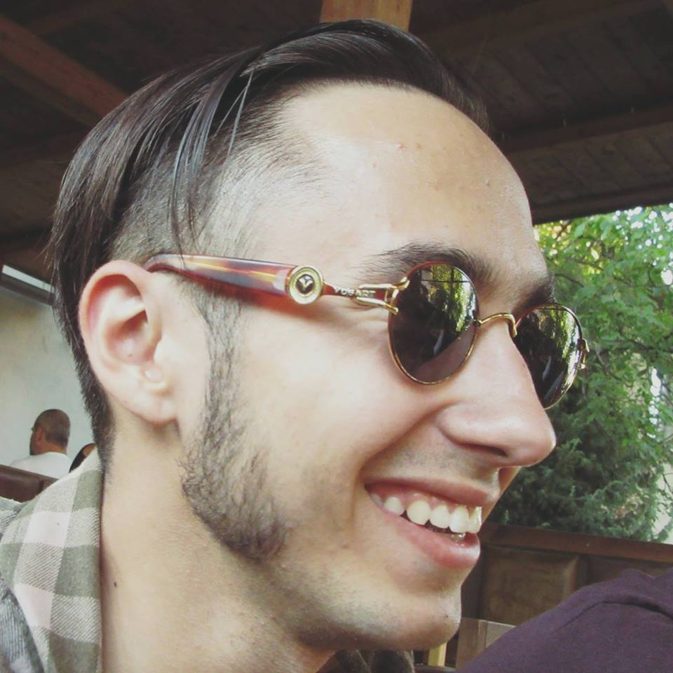

# andCardsQR

We demonstrate the first prototype of our solution to the problem of ineffective networking during large and medium-sized conferences. You can watch the video to see how it works: https://youtu.be/GtwK_A4dS3s.

The prototype was created during the Design Thinking course at Ukrainian Catholic University. The business case was provided by [andCards](https://andcards.com) - a company based in South Korea that provides software for coworking spaces.

## Design Thinking workflow

> Design thinking is a human-centered approach to innovation that draws from the designer's toolkit to integrate the needs of people, the possibilities of technology, and the requirements for business success.
>
> -- <cite>Tim Brown, CEO of IDEO</cite>

### Step 1: Empatize

In order to understand the deep needs of people who attend conferences, we have interviewed 10 people, including
* 1 professor of history
* 1 professor of mathematics
* 1 senior software developer
* 1 student of Lviv Business School
* 6 Computer Science bachelor students

We were asking them various questions, trying to gain insight about both their good and bad experiences. The information we acquired was very unstructured, but we could already see some patterns in how people with such different backgrounds behave, what drives them, and what causes problems.

Of course, a sample of 10 people from one university is not enough for some generalized statistical inference, but it's enough to give us the idea of what problems people face when attending conferences.

### Step 2: Define

Once we had enough information to process it was time to mine it for useful insights that would allow us to identify problems those people are facing on conferences and clearly define one specific problem we will be trying to solve

### Step 3: Ideate

On this step we started brainstorming the ideas. It's truly impressive how many ideas can four people generate in 20 minutes.  Most ideas were just crazy and required things like teleportation, space travel, or artificial intelligence. But we were going for quantity, not quality, and building on top of these silly ideas we came up with really good ones. 

After having generated over 100 ideas we went on to structure and organize them. We started by separating three clusters:

* **IT solutions**: creating an app or a website
* **Organizational solutions**: long coffee breaks, tour guides etc.
* **"Magic"**: conference in open space, reading minds, becoming part of collective superintelligence etc.

### Step 4: Prototype

### Step 5: Test

## Team

### Oleksandr Zaytsev

**Company:** N-iX

**Position:** Data Scientist

**Email:** oleks@ucu.edu.ua

### Yuriy Pryima

**Company:** Global Logic

**Position:** Machine Learning Engineer

**Email:** y.pryima@ucu.edu.ua

### Kateryna Liubonko

**Company:** Ukrainian Catholic University

**Position:** Student

**Email:** aloshkina@ucu.edu.ua

### Iryney Baran

**Company:** Soft Serve

**Position:** Software Engineer

**Email:** i.baran@ucu.edu.ua
